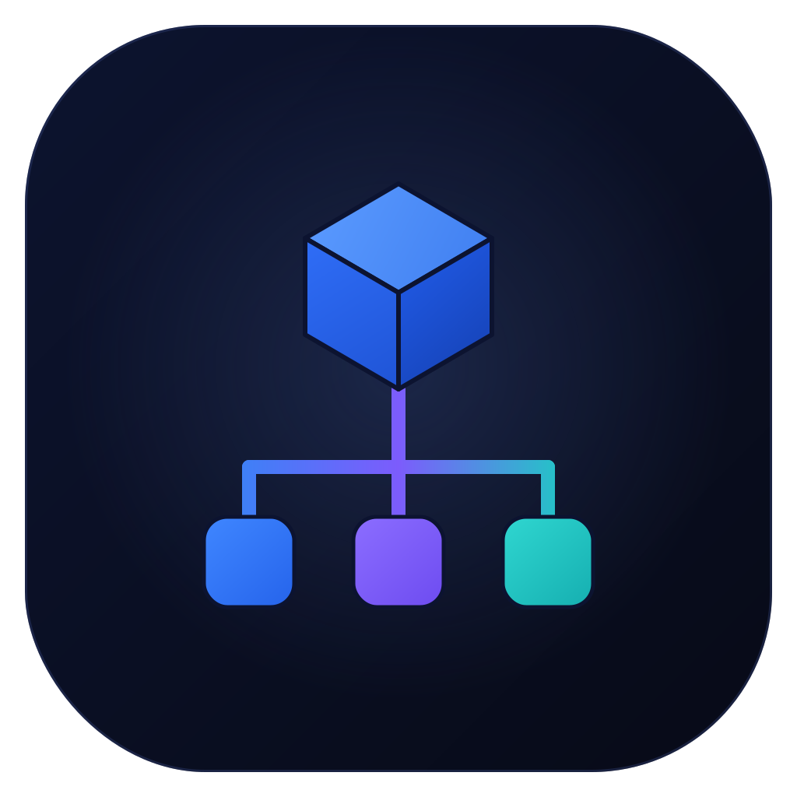
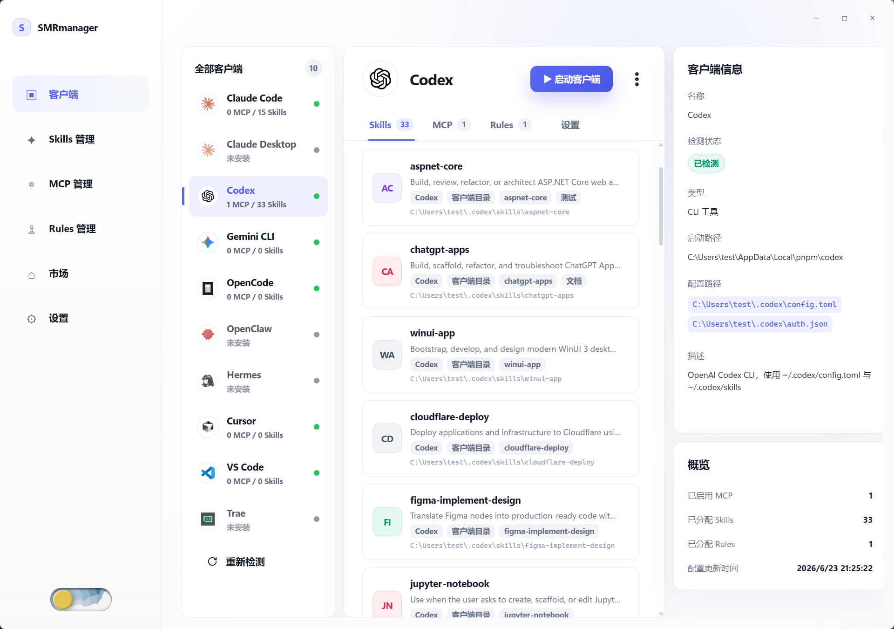
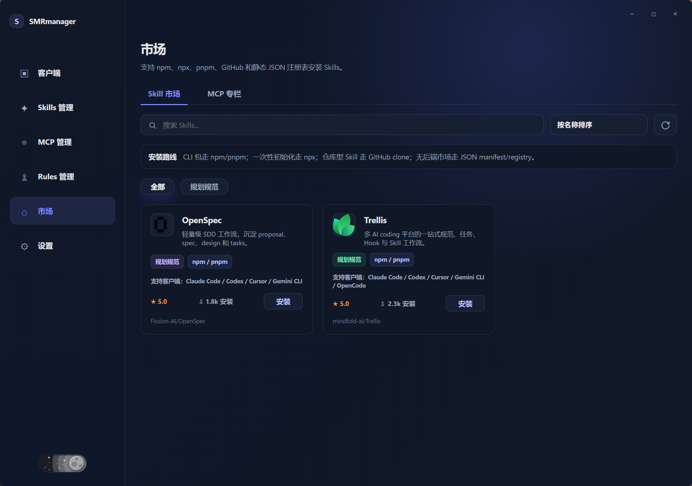
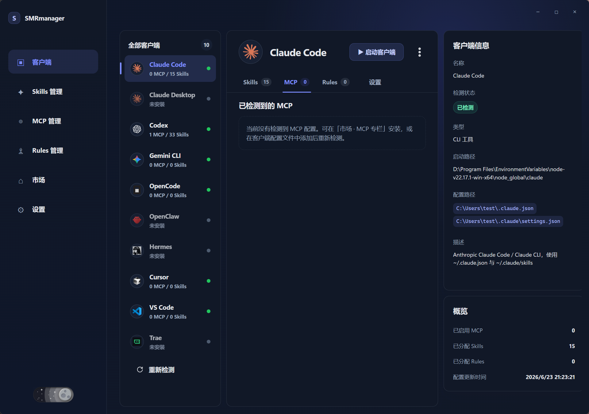
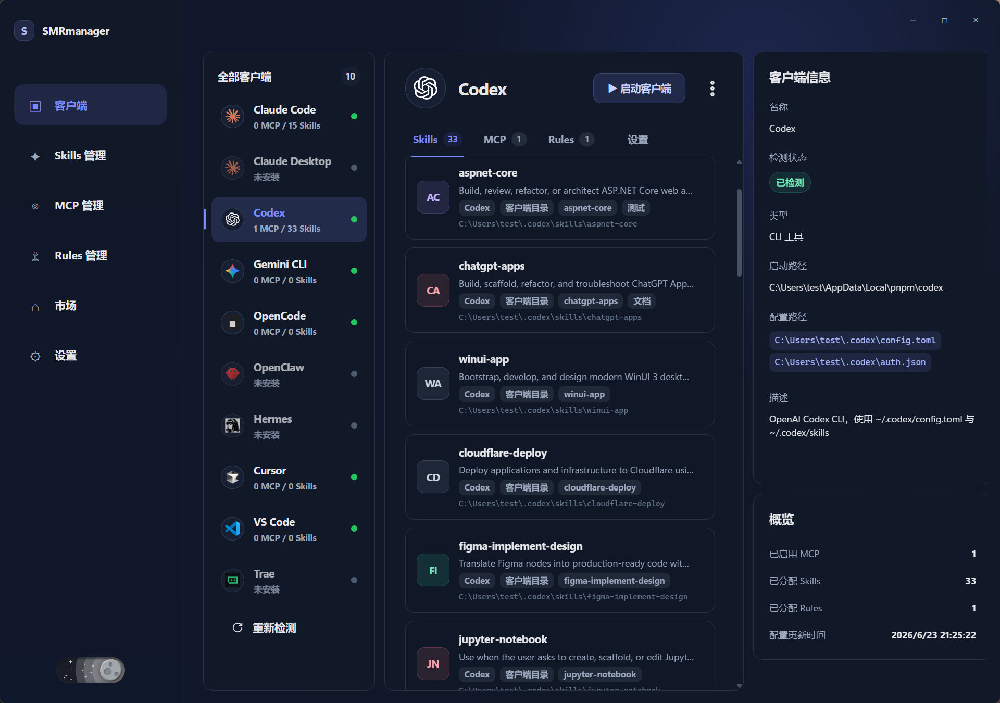
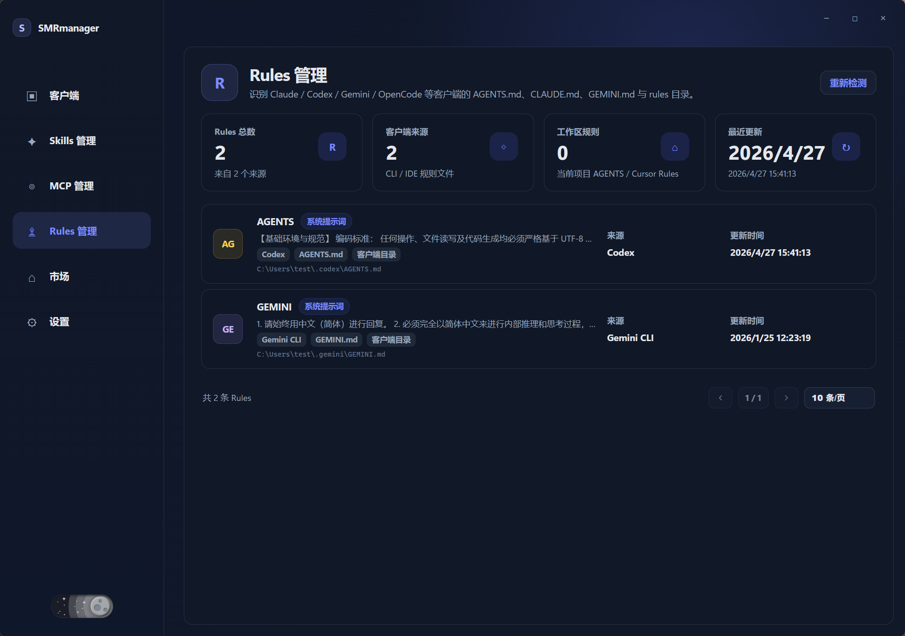

<div align="center">
  
  <h1>SMRmanager</h1>
  <p>一站式管理多个 AI 编程客户端的 <b>Skills / MCP / Rules</b> 桌面工具</p>
  <p><sub>Tauri 2 · Vite · TypeScript · TailwindCSS</sub></p>
</div>

## 简介

SMRmanager 会自动检测本机已安装的主流 AI 编程客户端（Claude Code、Claude Desktop、Codex、Gemini CLI、OpenCode、OpenClaw、Hermes、Cursor、VS Code、Trae），把原本分散在各客户端配置目录里的 **Skills、MCP 服务、Rules** 统一到一个界面集中查看与管理，免去手动翻配置文件、来回拷贝的麻烦。

- **Skills 管理** — 跨客户端复制 / 移动 / 删除 / 导入，右键快捷操作，多选批量处理，列表/网格视图与分页。
- **MCP 管理** — 真实启用 / 禁用（把 server 移入/移出客户端配置，客户端真的不再加载）、一键禁用全部、一键打开配置文件。
- **市场** — 内置 Skill 与 MCP 专栏，支持搜索 / 排序 / 分类；安装时按"客户端是否支持"自动校验，并能识别通过 npm 全局安装的 Skill。
- **客户端** — 启动客户端、导出 / 导入 / 删除客户端配置（删除走回收目录，可恢复）。
- **主题** — 日间 / 夜间 / 跟随系统 三态，内置 GitHub Releases 更新检查。

## 界面预览

<p align="center">
  
  <br /><sub>客户端管理 · 统一查看各客户端的 Skills / MCP / Rules（日间模式）</sub>
</p>

<table>
  <tr>
    <td width="50%"></td>
    <td width="50%"></td>
  </tr>
  <tr>
    <td align="center"><sub>市场 · Skill / MCP 专栏（搜索 · 排序 · 按客户端安装）</sub></td>
    <td align="center"><sub>MCP 管理 · 状态切换 / 一键禁用</sub></td>
  </tr>
  <tr>
    <td width="50%"></td>
    <td width="50%"></td>
  </tr>
  <tr>
    <td align="center"><sub>Skills 管理 · 复制 / 移动 / 删除 / 导入</sub></td>
    <td align="center"><sub>Rules 管理</sub></td>
  </tr>
</table>

## 开发

```bash
npm install
npm run tauri dev
```

## 构建前端

```bash
npm run build
```

## Star 趋势

<p align="center">
  <a href="https://star-history.com/#Kuddev/SMRmanager&Date">
    
  </a>
</p>

## 友情链接

- [LINUX DO](https://linux.do) —— 新的理想型社区
